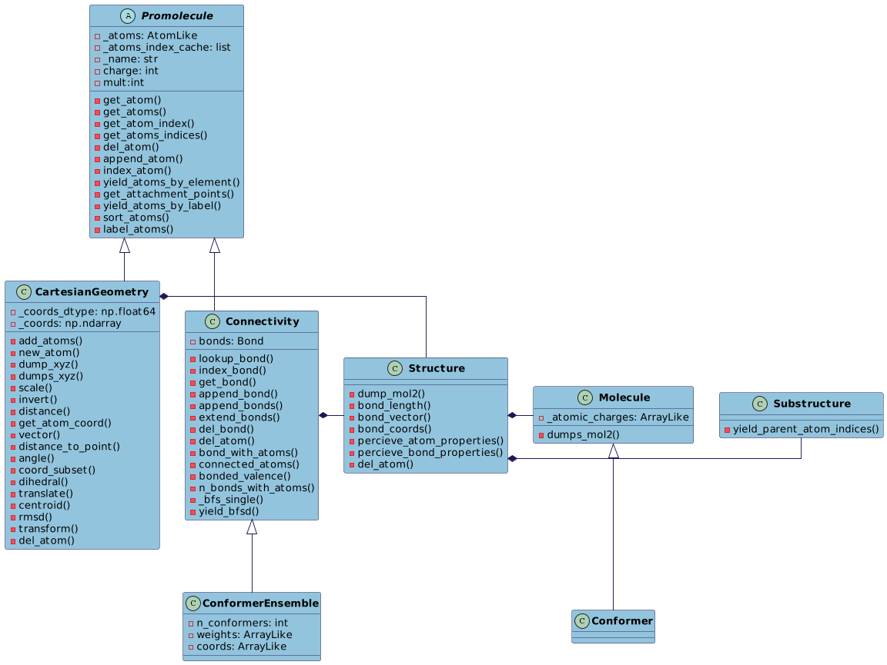

Inheritance Diagram for Molli
======================================

This diagram represents the inheritance of the Molli classes. 

This graph can either be used to get a quick overview of how each class in Molli relates to another. Additionally, it can be used to 
navigate to the documentation of a specific class.

      
